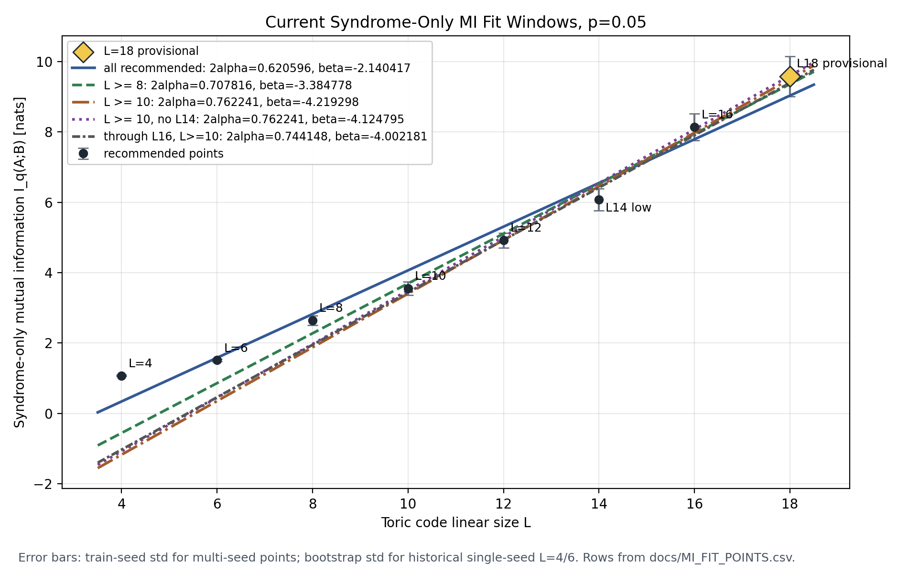
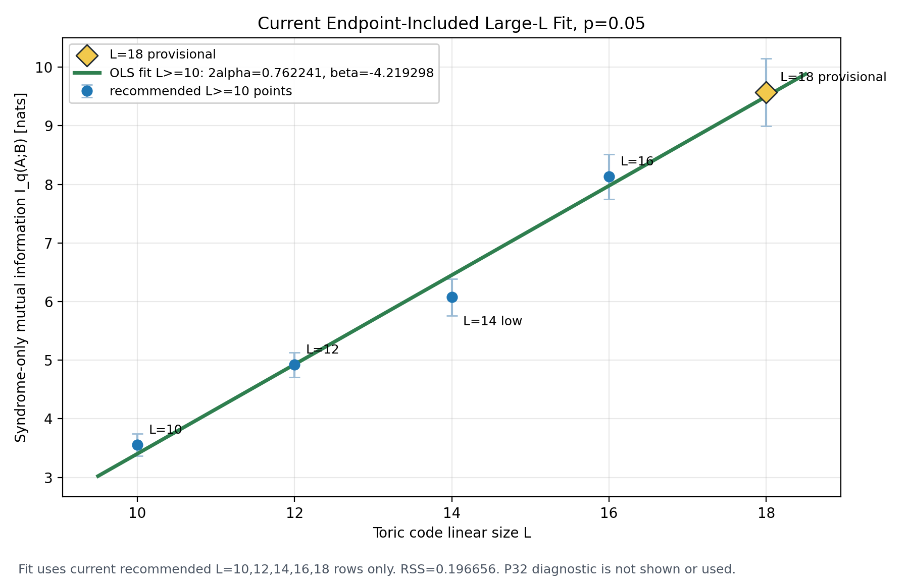

# Current Progress Report: Syndrome-Only Toric-Code MI Scaling

Date: 2026-06-10

This report summarizes the current state of the syndrome-only mutual
information (MI) scaling workflow for toric-code experiments in this
repository. The active target is the boundary-law fit at fixed physical error
rate `p = 0.05`.

## 1. Syndrome-Only MI Calculation and Scaling Theory

### 1.1 Syndrome-Only Mutual Information Estimator

The workflow uses syndrome configurations rather than explicit physical error
patterns. For a toric code at fixed noise rate, each sample is a binary syndrome
configuration. A spatial bipartition splits the syndrome coordinates into two
regions:

```text
s = (a, b), with a in region A and b in region B.
```

The physical noise process induces an unknown syndrome distribution `P(a,b)`.
The code does not enumerate this distribution. Instead, it trains
autoregressive models `q_theta` on syndrome samples and estimates entropy terms
from the learned model distribution.

For an ordered syndrome sequence

```text
x = (x_1, x_2, ..., x_m),
```

an autoregressive model represents

$$
q_\theta(x)
= \prod_{t=1}^{m} q_\theta(x_t \mid x_{<t}),
$$

so the model negative log-likelihood decomposes token by token:

$$
-\log q_\theta(x)
= \sum_{t=1}^{m} -\log q_\theta(x_t \mid x_{<t}).
$$

The model entropy is the expectation of this negative log-likelihood under the
same model:

$$
H(q_\theta)
= \mathbb{E}_{x \sim q_\theta}
  \left[-\log q_\theta(x)\right]
= \mathbb{E}_{x \sim q_\theta}
  \left[
  \sum_{t=1}^{m} -\log q_\theta(x_t \mid x_{<t})
  \right].
$$

The implementation in `decoding/mi_bipartite.py` estimates this expectation by
Monte Carlo sampling from the trained model. For `N = mi_samples` generated
samples `x^{(i)} ~ q_theta`, the full-sequence entropy estimate is

$$
\widehat H(q_\theta)
= \frac{1}{N}
  \sum_{i=1}^{N}
  \sum_{t=1}^{m}
  -\log q_\theta(x_t^{(i)} \mid x_{<t}^{(i)}).
$$

The bipartite estimator uses two trained models with two orderings:

```text
q_theta^AB: A syndrome bits first, then B syndrome bits.
q_phi^BA:   B syndrome bits first, then A syndrome bits.
```

For the `AB` model, samples are ordered as

```text
x^AB = (a_1, ..., a_|A|, b_1, ..., b_|B|).
```

Because region `A` is the prefix, the model marginal probability of `a` is

$$
q_\theta^{AB}(a)
= \prod_{t=1}^{|A|}
  q_\theta^{AB}(x_t \mid x_{<t}),
$$

and its prefix entropy is estimated as

$$
\widehat H_A
= \frac{1}{N}
  \sum_{i=1}^{N}
  \sum_{t=1}^{|A|}
  -\log q_\theta^{AB}(x_t^{(i)} \mid x_{<t}^{(i)}),
\qquad x^{(i)} \sim q_\theta^{AB}.
$$

The same `AB` samples also give the joint entropy estimate

$$
\widehat H_{AB}
= \frac{1}{N}
  \sum_{i=1}^{N}
  \sum_{t=1}^{m}
  -\log q_\theta^{AB}(x_t^{(i)} \mid x_{<t}^{(i)}),
\qquad x^{(i)} \sim q_\theta^{AB}.
$$

For the `BA` model, samples are ordered as

```text
x^BA = (b_1, ..., b_|B|, a_1, ..., a_|A|).
```

Because region `B` is now the prefix, its marginal entropy is estimated by

$$
\widehat H_B
= \frac{1}{N}
  \sum_{i=1}^{N}
  \sum_{t=1}^{|B|}
  -\log q_\phi^{BA}(x_t^{(i)} \mid x_{<t}^{(i)}),
\qquad x^{(i)} \sim q_\phi^{BA}.
$$

The final computed quantity is

$$
\widehat I_{\mathrm{comp}}(A;B)
= \widehat H_A + \widehat H_B - \widehat H_{AB}.
$$

If `q_theta^AB` and `q_phi^BA` are two accurate autoregressive representations
of the same underlying syndrome distribution `q(a,b)`, then this is an
estimate of

$$
I_q(A;B) = H_q(A) + H_q(B) - H_q(A,B).
$$

In practice, `AB` and `BA` are two separately trained models. The computed
value is therefore best understood as a two-model composed MI estimator. It
approaches the desired syndrome MI when both models fit the same underlying
joint distribution well and their ordering-dependent training errors are small.

The distinction between prefix and suffix terms is essential. In the `AB`
ordering, the suffix likelihood is

$$
q_\theta^{AB}(b \mid a),
$$

so the suffix NLL estimates a conditional entropy contribution, not the
marginal entropy `H(B)`. This is why the `BA` model is required to obtain
`H(B)` as a prefix entropy.

Bootstrap resampling is applied to the Monte Carlo entropy samples to estimate
evaluation noise. All entropy and MI values in the current records are
reported in nats.

### 1.2 From Local Syndrome Correlations to the Boundary-Law Fit

The linear fit is not introduced as a pure assumption. It follows from the
local structure of the syndrome distribution together with the chosen
left/right torus bipartition.

For code-capacity depolarizing noise at fixed `p`, physical error variables are
sampled locally and independently before they are mapped to syndrome checks.
Each syndrome bit is a local parity constraint on nearby physical errors.
Therefore correlations between syndrome bits are generated by local parity
relations and by the finite set of global constraints fixed by the chosen
syndrome coordinate system.

Now split the torus into left and right regions `A` and `B`. Syndrome checks
deep inside `A` are separated from syndrome checks deep inside `B` by a
distance of order `L`. At fixed `p = 0.05`, away from a critical point, the
connected correlations relevant to the syndrome distribution are expected to
have a finite correlation length `xi(p)`. Consequently, syndrome degrees of
freedom farther than `O(xi(p))` from the cut contribute only exponentially
small corrections to the mutual information between the two regions.

This reduces the leading contribution to a boundary strip:

```text
A_bulk -- A_boundary_strip | B_boundary_strip -- B_bulk
```

The bulk regions mainly contribute to the separate entropies `H(A)` and `H(B)`
and cancel in the combination

```text
H(A) + H(B) - H(A,B).
```

The terms that do not cancel are localized near the interface, where the
syndrome constraints and error variables couple information across the
bipartition. Along a straight cut on a large torus, the local environment is
translation-invariant up to finite-size effects, so each unit length of
boundary contributes approximately the same amount to the MI. Denote this
effective contribution per unit boundary length by `alpha(p)`.

For a half-system cut on the torus, there are two disjoint interfaces because
of periodic boundary conditions. Each interface has length `L`, so the total
boundary length is

```text
|partial A| = 2L.
```

The leading contribution is therefore

```text
alpha(p) |partial A| = 2 alpha(p) L.
```

Subleading terms remain. These include finite-size corrections from the finite
boundary-strip width, residual long-range or global syndrome constraints,
coordinate-system effects from using independent syndrome generators, and
constant geometry-dependent offsets. These effects are collected into
`beta(p)` and a vanishing correction term:

$$
I(L) = 2\alpha(p)L + \beta(p) + o(1).
$$

The numerical fit is performed as

$$
I(L) = aL + b,
$$

with the interpretation

$$
a \simeq 2\alpha(p),
\qquad
b \simeq \beta(p).
$$

The fitted slope is therefore an estimate of twice the boundary MI density for
the torus half cut. The intercept should not be interpreted as a universal
constant without specifying the syndrome coordinate convention, geometry, and
fit window.

## 2. Core Computational Pipeline

The repository implements a full syndrome-only MI workflow:

```text
code generation
-> syndrome dataset generation
-> AB/BA model training
-> entropy evaluation
-> MI aggregation
-> scaling fit
```

The main implementation components are:

- `decoding/code_generator.py`: generates or reloads code instances.
- `decoding/syndrome_dataset.py`: builds syndrome-only datasets for a spatial
  bipartition.
- `decoding/train_mi_syndrome.py`: trains autoregressive syndrome models.
- `decoding/mi_bipartite.py`: evaluates `H(A)`, `H(B)`, `H(A,B)`, and MI from
  paired checkpoints.
- `decoding/mi_scale_analysis.py`: aggregates per-run MI records into
  `MI vs L` summaries and plots.
- `decoding/run_mi_scale_sweep.py`: orchestrates code generation, dataset
  construction, training, evaluation, and summary generation.
- `scripts/run_mi_agent_audits.sh`: runs the required theoretical and ordering
  audits before formal MI work.

The generated datasets, checkpoints, result JSON files, and plots normally live
under `net/mi_scaling/`. Lightweight fit records and reports are preserved in
`docs/`.

## 3. Training Method

The current mainline model is a MADE autoregressive model trained on
syndrome-only data. The active baseline architecture is:

```text
model: MADE
depth: 0
width: 64
activation: tanh
residual: false
```

The current historical active protocol uses:

```text
n_train = 400000
batch = 512
lr = 0.001
weight_decay = 0
grad clipping = none
warmup = none
p = 0.05
error model = depolarizing
partition = x-mid
```

For every train seed and every fixed `L`, the workflow trains paired models:

```text
one AB model
one BA model
```

Checkpoints are selected by validation negative log-likelihood (NLL), not by
the final MI value. MI is evaluated only after training. This separation is
important because the MI estimate should not be used to select checkpoints or
seeds.

The project has also tested several diagnostic variants:

- replacement train seeds at `L=18`;
- a `depth=1,width=8` MADE architecture branch;
- larger `n_train=1000000` data-size diagnostics;
- AdamW with batch size 1024, lower learning rate, weight decay, gradient
  clipping, and warmup;
- a fixed-LR p32 branch after identifying and fixing a warmup/scheduler
  interaction in `decoding/train_mi_syndrome.py`.

The current protocol policy is conservative: MI values across different `L`
should be compared directly only within a fixed training protocol. If optimizer,
batch size, learning rate, scheduler behavior, architecture, data size, or
evaluation settings change, the result is diagnostic until an explicit policy
promotes a new protocol track.

## 4. Current Training Progress and Fit Status

### 4.1 Recommended MI Fit Points

The current recommended fit inputs are the rows in `docs/MI_FIT_POINTS.csv`
with `include_in_recommended_fit=yes`.

| L | n | run id | seeds | n_train | MI | seed std | status |
|---:|---:|---|---:|---:|---:|---:|---|
| 4 | 32 | `p8_made_plateau_long_468` | 1 | | 1.074160 | 0.000000 | historical single point |
| 6 | 72 | `p8_made_plateau_long_468` | 1 | | 1.513966 | 0.000000 | historical single point |
| 8 | 128 | `p18_l8_ntrain400k` | 8 | 400000 | 2.640582 | 0.132981 | current multi-seed point |
| 10 | 200 | `p26_l10_l12_made_depth0_width64_ntrain400k` | 8 | 400000 | 3.557084 | 0.190860 | current multi-seed point |
| 12 | 288 | `p26_l10_l12_made_depth0_width64_ntrain400k` | 8 | 400000 | 4.921827 | 0.210903 | current multi-seed point |
| 14 | 392 | `p17_l14_ntrain400k` | 8 | 400000 | 6.074064 | 0.313907 | usable; independently checked by p27 |
| 16 | 512 | `p16_l16_ntrain400k` | 8 | 400000 | 8.133990 | 0.382952 | current multi-seed point |
| 18 | 648 | `p19_l18_ntrain400k_pilot` | 8 | 400000 | 9.573411 | 0.574411 | provisional endpoint |

The recommended records currently cover `L=4,6,8,10,12,14,16,18`. The small
`L=4,6` rows are historical single-point records. The large-`L` rows from
`L=8` onward are multi-seed aggregates, except that `L=18` remains provisional
because of endpoint sensitivity.

### 4.2 Current Fitted Slopes

The current boundary-law interpretation should quote two windows.

The endpoint-included multi-seed large-`L` window is:

```text
points: L = 10, 12, 14, 16, 18
2 alpha = 0.762241
alpha = 0.381120
beta = -4.219298
RSS = 0.196656
```

The endpoint-stable comparison window is:

```text
points: L = 10, 12, 14, 16
2 alpha = 0.744148
alpha = 0.372074
beta = -4.002181
RSS = 0.183562
```

The endpoint-included result uses the current provisional `L=18` row. It should
not be quoted alone. Any endpoint-sensitive conclusion should also report the
through-`L=16` comparison.

Other recorded fit windows from the current analysis include:

| Window | Points | 2 alpha | alpha | beta | RSS |
|---|---|---:|---:|---:|---:|
| all recommended | `L=4,6,8,10,12,14,16,18` | 0.620596 | 0.310298 | -2.140417 | 1.619790 |
| bridge and large-L | `L=8,10,12,14,16,18` | 0.707816 | 0.353908 | -3.384778 | 0.473119 |
| current multi-seed large-L | `L=10,12,14,16,18` | 0.762241 | 0.381120 | -4.219298 | 0.196656 |
| without L14 | `L=10,12,16,18` | 0.762241 | 0.381120 | -4.124795 | 0.018041 |
| through L16 | `L=10,12,14,16` | 0.744148 | 0.372074 | -4.002181 | 0.183562 |

The `without L14` window has the same slope as the current `L=10..18` window
but a much lower RSS. This does not justify removing `L=14`; instead it marks
`L=14` as a visible finite-size or local-curvature point.

### 4.3 Current Fit Figures

The current fit-window figure below was regenerated from
`docs/MI_FIT_POINTS.csv`. It uses the current recommended rows and overlays the
main OLS fit windows. The endpoint-included `L >= 10` fit gives
`2 alpha = 0.762241`, while the through-`L=16` comparison gives
`2 alpha = 0.744148`. The `L=14` point is visibly low relative to its
neighbors, but it remains part of the recommended fit.



The second figure isolates the current endpoint-included large-`L` fit. It
shows only the recommended `L=10,12,14,16,18` points and one OLS fitting line.
No p32 diagnostic point is shown or used in this figure.



The fit shown in the second figure is:

```text
points: L = 10, 12, 14, 16, 18
2 alpha = 0.762241
alpha = 0.381120
beta = -4.219298
RSS = 0.196656
```

### 4.4 Progress Summary

The current workflow has produced a usable syndrome-only MI curve through
`L=18`, with multi-seed results from `L=8` onward. The `L=14` point remains a
visible finite-size/local-curvature feature rather than an outlier to remove.
The `L=18` point is the largest available endpoint and is kept in the
recommended curve, but it remains provisional because endpoint diagnostics show
substantial protocol and train-seed sensitivity. For this reason, current
interpretations should report both the endpoint-included `L=10..18` slope and
the through-`L=16` comparison.

## 5. Long-Term Plan

The next stage should move from ad hoc endpoint diagnostics toward a more
systematic training-quality protocol. The v3 MADE quality-scaling design should
map `L` and stage (`pilot` or `formal`) to:

```text
n_train
n_val
n_test
max optimizer steps
epoch
warmup steps
early-stop min delta
train seeds
run id
log path
```

The v3 design keeps MADE `depth=0,width=64` but fixes data size and training
budget as functions of `n = 2L^2`, rather than hand-tuning each size. It is a
future mainline candidate for testing whether a consistent size-dependent
training budget can reduce protocol drift across larger systems.

If MADE continues to show endpoint sensitivity under a fixed quality-scaling
protocol, the natural future direction is an architecture change, such as a
CNN/PixelCNN-style autoregressive model better matched to the local geometry of
syndrome data. Future reports should keep recommended fit rows protocol-fixed:
new optimizer, architecture, data-size, or scheduler changes should first be
recorded as diagnostic tracks before they are promoted into the main scaling
fit.
